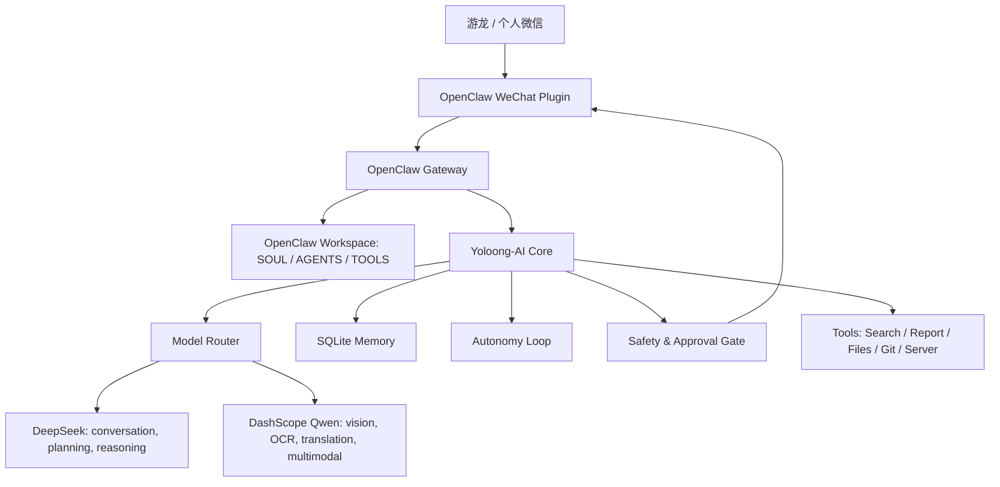

<!--
Copyright 2026 Jiacheng Ni

Licensed under the Apache License, Version 2.0 (the "License");
you may not use this file except in compliance with the License.
You may obtain a copy of the License at

    http://www.apache.org/licenses/LICENSE-2.0

Unless required by applicable law or agreed to in writing, software
distributed under the License is distributed on an "AS IS" BASIS,
WITHOUT WARRANTIES OR CONDITIONS OF ANY KIND, either express or implied.
See the License for the specific language governing permissions and
limitations under the License.
-->

# Yoloong-AI 架构

## 核心诉求

Yoloong-AI 不是普通聊天机器人，而是长期运行在服务器上的个人助手。它需要通过个人微信与用户交互，保持江徽音人格，具备主动关怀和自主规划能力，并在涉及核心操作时通过微信向用户确认。

## 分层结构



## 组件职责

- OpenClaw Gateway：承接微信等外部消息入口，维护渠道会话，把用户消息交给工作区代理处理。
- OpenClaw Workspace：保存江徽音人格、工具约束、权限边界和模型路由说明。
- Yoloong-AI Core：提供独立可测的 Python 核心，负责记忆、主动循环、审批、工具调用和 webhook。
- Model Router：按能力选择模型。中文文本对话优先 DeepSeek，多模态能力优先 Qwen。
- Memory Store：保存用户偏好、关系连续性、消息、任务、审批记录和工具结果。
- Autonomy Loop：无任务时按时间、记忆和待办生成主动行动建议；有任务时持续推进。
- Safety Gate：把动作分为低、中、高、核心级风险。核心操作必须微信确认。
- Tools：包含网络检索、中国地区报告、文件任务、Git、服务器部署和外部消息发送等能力。

## 权限策略

低风险动作可自动执行：

- 主动关怀、问候、日程轻提醒。
- 只读记忆查询。
- 只读网络检索。
- 生成草稿、计划、报告。

需要确认的核心动作：

- 服务器改配置、安装服务、重启守护进程。
- Git commit、push、创建 PR 或发布。
- 删除、覆盖、移动重要文件。
- 对用户以外的人发送外部消息。
- 读取或迁移密钥、cookie、私钥。
- 支付、转账、订阅、购买、生产环境高危操作。

## 微信接入

个人微信使用 OpenClaw 官方微信插件：

- 插件包：`@tencent-weixin/openclaw-weixin`
- 登录方式：手机扫码。
- 运行方式：推荐 systemd 管理 OpenClaw 与 Yoloong-AI sidecar。

扫码授权无法由代码自动完成，因此真实微信登录属于人工一次性绑定步骤。绑定完成后，Yoloong-AI 可以通过 OpenClaw 工作区和 webhook 处理消息。

## 模型路由

| 能力 | 默认提供方 | 默认模型 |
| --- | --- | --- |
| 日常对话 | DeepSeek | `deepseek-v4-pro` |
| 快速回复 | DeepSeek | `deepseek-v4-flash` |
| 规划推理 | DeepSeek | `deepseek-v4-pro` |
| 图片理解 | DashScope/Qwen | `qwen3-vl-plus` |
| OCR | DashScope/Qwen | `qwen-vl-ocr-latest` |
| 翻译 | DashScope/Qwen | `qwen-mt-plus` |
| 通用多模态 | DashScope/Qwen | `qwen3.6-plus` |

所有模型密钥只从环境变量读取，不写入代码、日志或 Git。

## 中国地区搜索策略

默认区域策略为 `china`：

- 优先检索官方和权威中文源：`gov.cn`、`stats.gov.cn`、`weather.com.cn`、`people.com.cn`、`xinhuanet.com` 等。
- 报告中保留来源 URL 和检索时间。
- 对全国、各省市、政策、天气、交通、经济数据等内容，优先使用中国本地或官方源。
- 不把单一搜索结果直接当结论，报告生成时要求交叉验证。

## 运行形态

服务器建议目录：

```text
/opt/yoloong-ai/
  app/
  openclaw-workspace/
  data/
  logs/
/etc/yoloong-ai/yoloong-ai.env
```

守护进程：

- `yoloong-ai.service`：运行 Python sidecar 和主动循环。
- `openclaw.service`：运行 OpenClaw gateway。
- `openclaw-weixin.service`：运行微信插件登录态。

## 测试策略

独立测试目录 `tests/` 覆盖：

- 环境配置与密钥隐藏。
- DeepSeek/Qwen 模型路由。
- 江徽音人格加载。
- SQLite 记忆和审批状态。
- 风险分级和微信确认文案。
- 微信事件归一化。
- 主动循环在空闲时生成行动。
- 网络搜索解析和中国地区查询策略。

真实微信扫码、真实模型 API、真实服务器重启不纳入单元测试，作为部署后的集成验证项目单独执行。
